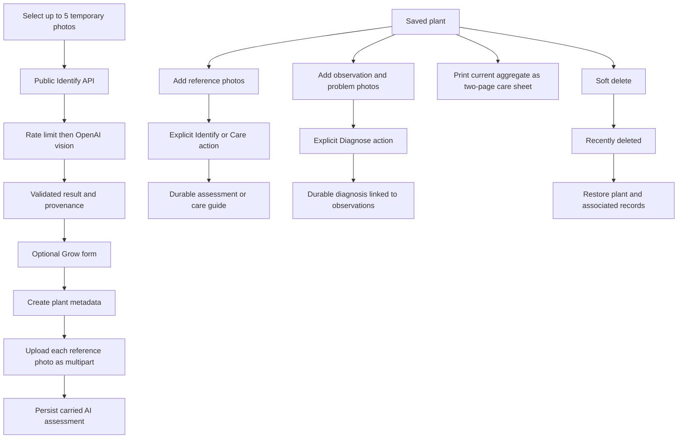

# Plant ID Codemap

## Start Here

- Product direction: `README.md`
- Current verified state: `PROJECT_STATUS.md`
- Architecture and invariants: `DESIGN.md`
- Active coordination: `CHATGPT_HANDOFF.md`
- App composition: `src/App.jsx`
- Identify workflow: `src/features/identify/IdentifyExperience.jsx`
- Garden workflow: `src/features/garden/GardenExperience.jsx`

## Primary Flows

## Frontend

| Path                                           | Responsibility                                                                   |
| ---------------------------------------------- | -------------------------------------------------------------------------------- |
| `src/App.jsx`                                  | Identify/Garden mode and owner unlock transition                                 |
| `src/features/identify/IdentifyExperience.jsx` | Temporary reference-photo selection, request identity/abort handling, and result |
| `src/features/garden/GardenExperience.jsx`     | Garden, Grow, and plant-record state plus API transitions                        |
| `src/features/garden/GardenViews.jsx`          | Garden list, forms, purpose-separated photos, care, observations, and diagnosis  |
| `src/features/garden/PlantPrintView.jsx`       | Two-page print-only care sheet derived from the current plant aggregate          |
| `src/components/AppChrome.jsx`                 | Shared title, mode control, error, and unlock UI                                 |
| `src/components/UploadPanel.jsx`               | Public upload surface and browser file validation                                |
| `src/components/ResultPanel.jsx`               | Public identification result and uncertainty UI                                  |
| `src/lib/api.js`                               | JSON API and one-photo multipart helpers                                         |
| `src/lib/photos.js`                            | Local preview lifecycle and shared file validation                               |

## Server

| Path                                       | Responsibility                                              |
| ------------------------------------------ | ----------------------------------------------------------- |
| `api/identify-plant.js`                    | Public, rate-limited identification orchestration           |
| `api/garden-identify-plant.js`             | Authorized identification from selected reference photos    |
| `api/garden-plants.js`                     | Authorized active/deleted plant list and create metadata    |
| `api/garden-plants/[id].js`                | Authorized plant read/edit/soft delete/restore              |
| `api/garden-plants/[id]/photos.js`         | Bounded one-photo multipart persistence                     |
| `api/garden-plants/[id]/ai-assessments.js` | Persist a carried public assessment                         |
| `api/garden-plants/[id]/care-guide.js`     | Explicit care-guide generation/persistence                  |
| `api/garden-plants/[id]/observations.js`   | Dated observation persistence                               |
| `api/garden-plants/[id]/diagnoses.js`      | Observation-first diagnosis generation/persistence          |
| `api/garden-photos/[id].js`                | Authorized private photo bytes and soft removal             |
| `server/plant-identification-core.js`      | Multipart parsing, vision request, and result validation    |
| `server/garden-ai-core.js`                 | Strict structured care and diagnosis calls                  |
| `server/garden-store.js`                   | Plant metadata and aggregate serialization                  |
| `server/garden-photo-store.js`             | Purpose-aware private photo persistence                     |
| `server/garden-record-store.js`            | Assessment, care, observation, and diagnosis records        |
| `server/garden-validation.js`              | Garden text, purpose, provenance, photo, and request limits |
| `server/garden-session.js`                 | Owner-key and signed-session boundary                       |
| `server/rate-limit.js`                     | Supabase-backed public request limit boundary               |

## Persistence

- `202608200001_plant_id_rate_limits.sql`: isolated fixed-window counters.
- `202608200002_plant_id_private_garden.sql`: private plants/photos.
- `202608200003_plant_id_plant_name_polish.sql`: Plant Name migration.
- `202608200004_plant_id_part_4_records.sql`: photo purposes, durable domain records, current pointers, and corrected client/global accounting.

Normal request code contains no schema DDL.

## Verification

Choose checks that cover the changed surface. Part 5 has focused Node and Playwright coverage for restore, vertical order, accessibility, responsive overflow, and the two-page print layout; use broad regression suites only when shared behavior changes.

Use `npx vercel dev` for local serverless API behavior. Vercel Preview protection can be checked with `npx vercel curl`; set `PLAYWRIGHT_BASE_URL` and `PLAYWRIGHT_VERIFY_AUTH=1` for the unauthenticated API assertion against production.
