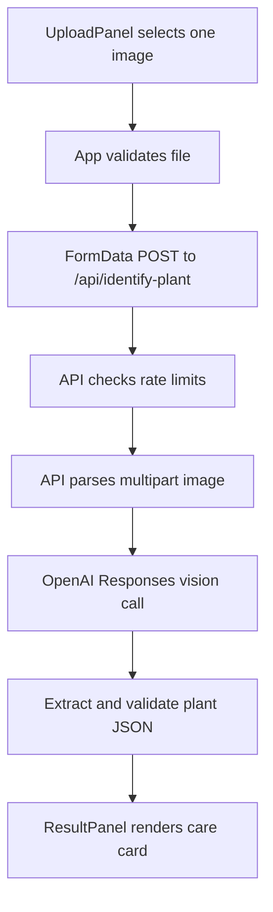

# Plant ID Codemap

## Start Here

- Product direction: `README.md`
- Current status and verified commands: `PROJECT_STATUS.md`
- Architecture and invariants: `DESIGN.md`
- Active handoff: `CHATGPT_HANDOFF.md`
- Main UI flow: `src/App.jsx`
- Serverless identification API: `api/identify-plant.js`

## Primary Flow



## Repository Map

| Path | Responsibility |
|---|---|
| `README.md` | Current purpose, approved product direction, setup, Vercel, rate limiting, safety |
| `AGENTS.md` | Project-specific Codex rules and commands |
| `PROJECT.md` | Vision, current milestone, users, principles, non-goals |
| `DESIGN.md` | Architecture, data flow, invariants, future model direction |
| `PROJECT_STATUS.md` | Durable verified state and limitations |
| `TODO.md` | Deferred work and decisions |
| `CHATGPT_HANDOFF.md` | Active ChatGPT-to-Codex scope and outcome |
| `src/App.jsx` | Page shell and upload-to-result state machine |
| `src/components/UploadPanel.jsx` | File input, drag/drop, client image validation, preview |
| `src/components/ResultPanel.jsx` | Loading, empty, warning, result, alternatives, care details |
| `src/components/TraitBadge.jsx` | Care enum display metadata |
| `src/components/CareIcon.jsx` | Inline SVG care icons |
| `src/lib/plantSchema.js` | Frontend schema constants and trait copy |
| `src/index.css` | Tailwind import and app color variables |
| `api/identify-plant.js` | Serverless API orchestration, rate limiting, OpenAI call, response |
| `api/plant-identification-core.js` | Multipart image extraction, model JSON extraction, normalized result validation |
| `tests/identify-plant.test.cjs` | Unit tests for existing API helper behavior |

## How To Change

| If you want to... | Start in... | Then inspect... | Verify with... |
|---|---|---|---|
| Change current upload validation | `src/components/UploadPanel.jsx` | `src/lib/plantSchema.js`, `api/identify-plant.js` | `npm test`, `npm run build` |
| Change result fields or care sections | `api/plant-identification-core.js` | `api/identify-plant.js`, `src/components/ResultPanel.jsx`, `src/lib/plantSchema.js` | `npm test`, `npm run build` |
| Change OpenAI prompt or model behavior | `api/identify-plant.js` | `README.md`, `DESIGN.md` | `npm test`, manual `npx vercel dev` check with credentials |
| Add My Garden persistence | `DESIGN.md` | `PROJECT.md`, `TODO.md`, future Supabase schema | Add focused unit/integration tests before UI wiring |
| Add project-specific browser tests | new `playwright.config.*` | `tests/e2e/`, README commands | project Playwright command |
| Update deployment setup | `README.md` | `PROJECT_STATUS.md`, `.env.example` | `npm run build` and Vercel preview checks |

## Verification Entry Points

```bash
npm test
npm run build
npx vercel dev
```

`npx vercel dev` requires local environment variables for real identification and serves the serverless API route. `npm run dev` is frontend-only.
